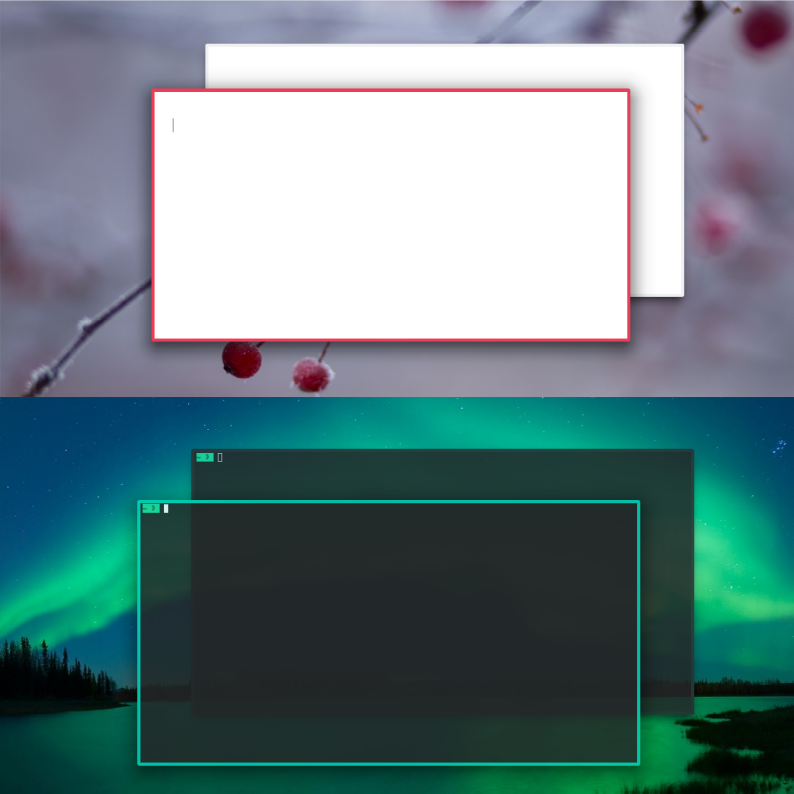

# Active Accent

Simple window decoration that frames the active window in the accent color and the inactive windows in the background color of the current color scheme.

The implementation is due to [@RealezzZ](https://www.reddit.com/r/kde/comments/ri4zko/comment/howapa9/?utm_source=share&utm_medium=web2x&context=3) and based on [Breeze Aurorae](https://store.kde.org/p/1461072/).

[view in KDE store](https://www.pling.com/p/1678088/)

## Installation

*System Settings* > *Appearance* > *Window Decorations* > *Get New Window Decorations …* > search for ‘Active Accent’ > *Install*.

## Configuration

You can find the installed theme in `~/.local/share/aurorae/themes/ActiveAccent/`. By editing the file `ActiveAccentrc`  you can easily make your own modifications:

- add a title bar: set a non-zero value for `TitleHeight` (default height in Breeze is 16)
- change the color of the titlebar text (Aurorae themes won't respect the specifications of the color scheme): remove the leading `#` and set a matching RGB value for `ActiveTextColor`/`InactiveTextColor`
- change the thickness of the borders: change the value for `BorderBottom`/`BorderLeft`/`BorderRight`/`TitleEdgeTop`/`TitleEdgeTopMaximized'
