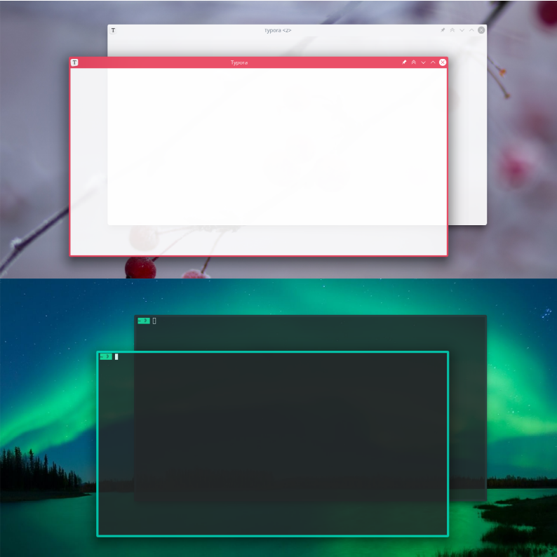

# Active Accent

Breeze-based window decoration with or without titlebar that frames the active window in the accent color and the inactive windows in the background color of the current color scheme.

The implementation is due to [@RealezzZ](https://www.reddit.com/r/kde/comments/ri4zko/comment/howapa9/?utm_source=share&utm_medium=web2x&context=3) and based on [Breeze Aurorae](https://store.kde.org/p/1461072/).

[view in KDE store](https://www.pling.com/p/1678088/)

## Installation

1. *System Settings* > *Appearance* > *Window Decorations* > *Get New Window Decorations …* > search for ‘Active Accent’ > *Install …*
2. Pick your flavor:
   - Light: With titlebar for light color schemes
   - Dark: With titlebar for dark color schemes
   - Frame: Without titlebar for light and dark color schemes
3. Select and apply.
